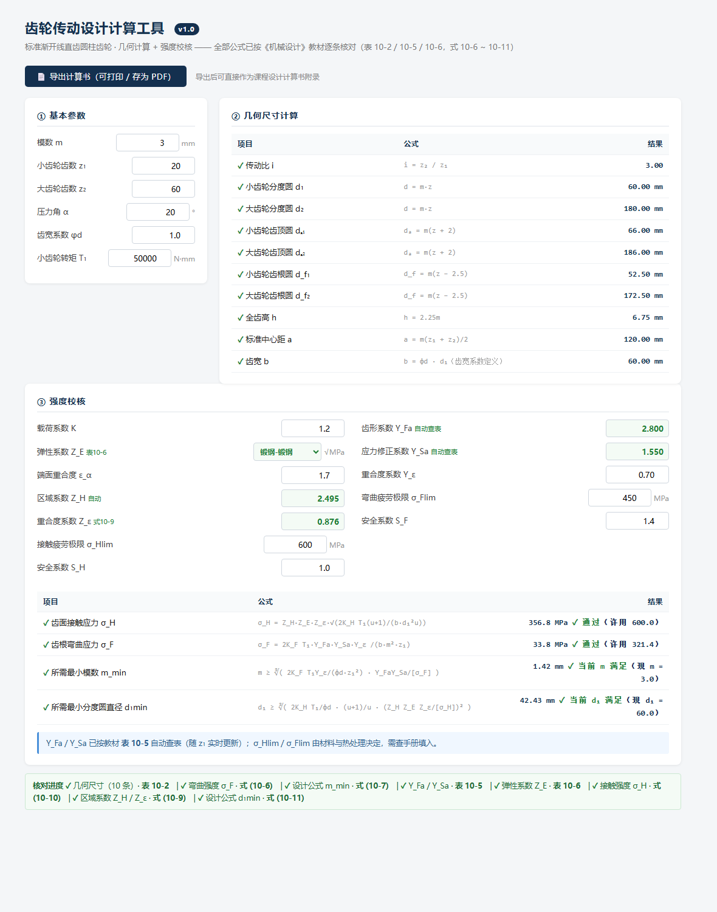

[中文](README.md) | **English**

# Spur Gear Design Calculator

A single-file web calculator for standard involute **spur gears**: geometry sizing and strength verification. No build step, no server, no dependencies — open the HTML file and it runs. Every formula is traceable to the textbook it came from.



## The problem this solves

In a mechanical design course project, gear calculations mean looking up tables, interpolating, applying formulas, and re-checking — then starting the whole chain over when one parameter changes. One hand-worked pass takes an hour or two, and a single transcription error anywhere invalidates everything downstream.

This tool automates the whole chain and **shows each formula next to its result**. What you see is not "an answer" — it is "how the answer was obtained."

## Features

**1. Inputs**
Module `m`, tooth counts `z₁`/`z₂`, pressure angle `α`, face width coefficient `φd`, pinion torque `T₁`

**2. Geometry (10 values, automatic)**
Gear ratio `i`, pitch diameters `d₁`/`d₂`, addendum circles `dₐ`, dedendum circles `d_f`, whole depth `h`, standard center distance `a`, face width `b`

**3. Strength verification**

| Quantity | Basis |
|---|---|
| Form factor `Y_Fa`, stress correction factor `Y_Sa` | **Table 10-5**, auto-interpolated, updates live with tooth count |
| Elasticity factor `Z_E` | **Table 10-6**, dropdown (steel-steel and other pairings) |
| Zone factor `Z_H` | **Eq. (10-9)**, computes `√(2/(cosα·sinα))` |
| Contact ratio factor `Z_ε` | **Eq. (10-9)**, computes `√((4−ε_α)/3)` |
| Bending contact ratio factor `Y_ε` | **Manual input** — the formula's textbook source is not yet verified, so it is deliberately not automated |
| Contact stress `σ_H` | **Eq. (10-10)** |
| Bending stress `σ_F` | **Eq. (10-6)** |
| Minimum required module `m_min` | **Eq. (10-7)**, solved backwards |
| Minimum required pitch diameter `d₁min` | **Eq. (10-11)**, solved backwards |

**4. One-click calculation report** — exports a printable page (print or save as PDF), formatted as an appendix for a course design report.

## Formula provenance

A permanent checklist at the bottom of the UI maps every computed quantity to its textbook source:

```
✓ Geometry (10 items)         · Table 10-2
✓ Bending stress σ_F          · Eq. (10-6)
✓ Design formula m_min        · Eq. (10-7)
✓ Y_Fa / Y_Sa                 · Table 10-5
✓ Elasticity factor Z_E       · Table 10-6
✓ Contact stress σ_H          · Eq. (10-10)
✓ Zone factors Z_H / Z_ε      · Eq. (10-9)
✓ Design formula d₁min        · Eq. (10-11)
```

### Textbook sources

- ***Machine Design* (机械设计), 11th ed.** — compiled by the Teaching and Research Section of Machine Theory and Machine Elements, Northwestern Polytechnical University; edited by Pu Lianggui, Chen Guoding, Wu Liyan and Ning Fangli. Higher Education Press, 2024.
  Every "Eq. (10-x)" and "Table 10-x" label in the UI refers to **Chapter 10, Gear Drives** of this book.
- ***Theory of Machines and Mechanisms* (机械原理), 9th ed.** — compiled by the Teaching and Research Section of Machine Theory and Machine Elements, Northwestern Polytechnical University; edited by Sun Huan and Ge Wenjie. Higher Education Press, 2021.
  Reference for gear meshing parameters such as the transverse contact ratio `ε_α`, which this tool takes as a manual input rather than computing.

Both books are *compiled* by Northwestern Polytechnical University — hence the colloquial name "the NPU edition" — but *published* by Higher Education Press.

At the default parameters (m=3, z₁=20, z₂=60, α=20°, φd=1.0, T₁=50000 N·mm), the tool's output matches hand calculation:

| Result | Value |
|---|---|
| Contact stress σ_H | 356.8 MPa |
| Bending stress σ_F | 33.8 MPa |
| Minimum module m_min | 1.42 mm |
| Minimum pitch diameter d₁min | 42.43 mm |

## Usage

Download `index.html` and open it in any browser. Nothing to install, no network, no server.

Or use it online: **https://ToumaTouko.github.io/gear-calc/**

## How this was built

This is **neither purely hand-written code nor purely AI-generated**. The boundary is clear:

- **Mine**: formula selection, calculation logic, parameter ranges, and verification of results. Every formula was checked line by line against the *Machine Design* textbook, and the four results above were recomputed by hand at the default parameters.
- **AI-assisted**: the HTML interface and the JavaScript implementation.

In other words — **the engineering judgment is mine; AI accelerated the typing.**

This disclosure is not a disclaimer. It is there to make one thing clear: I can explain why every formula in this tool looks the way it does.

## Known limitations

- **The bending contact ratio factor `Y_ε` is still entered by hand.** The relevant formula is on a page of the textbook I have not yet verified, and I would rather leave a gap than ship a formula I have not confirmed. (The contact-side factor `Z_ε` *is* computed automatically, via Eq. (10-9).)
- Supports **standard involute spur gears only** — no helical, profile-shifted, or bevel gears.
- `σ_Hlim` / `σ_Flim` (contact and bending fatigue limits) must be looked up in a materials handbook and entered manually.

## License

[MIT](LICENSE)
